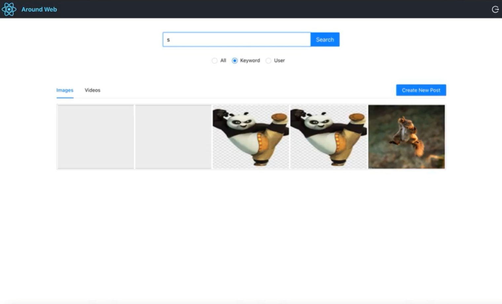

# Online social network application

* Conceptualized and built a social network web application using React, providing users with the
ability to create and view posts, as well as search for posts.
* Engineered various user-facing features using JavaScript, enhancing the overall user experience.
* Optimized the authentication process by integrating a token-based registration/login/logout flow
with React Router v4 and implementing server-side user authentication with JWT.
* Deployed a highly scalable web service written in Go to handle posts, utilizing Google App
Engine for deployment.
* Improved search functionality by incorporating Elasticsearch (deployed on GCE), enabling users
to easily search for recent posts and view their personal posts.

